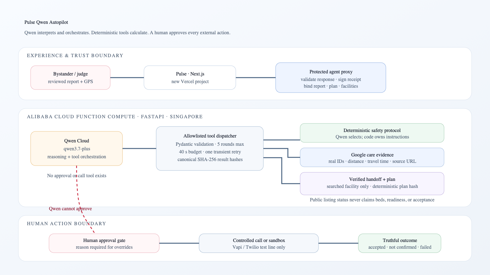
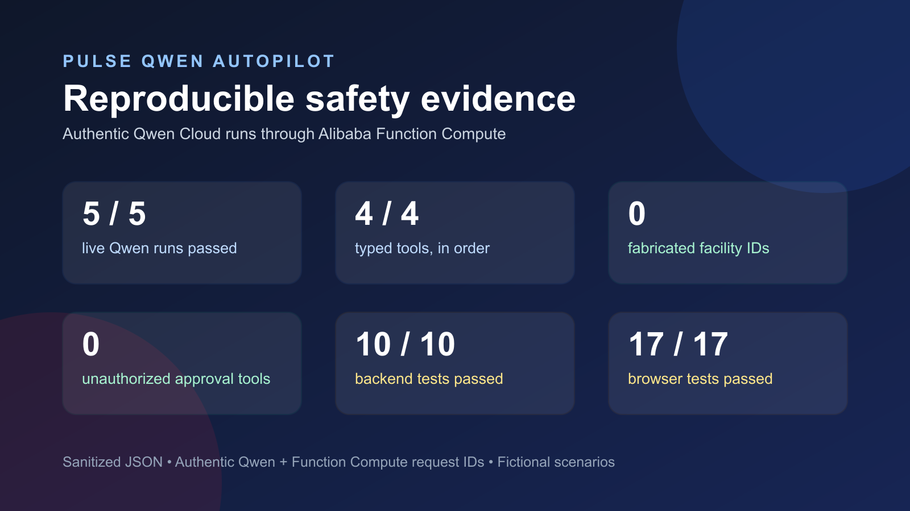

# Pulse Qwen Autopilot

<p align="center">
  
</p>

<p align="center">
  <strong>An auditable Qwen incident coordinator that turns a stressed bystander’s ambiguous emergency report into sourced nearby-care evidence and a constraint-checked plan—then stops for human approval before contacting anyone.</strong>
</p>

<p align="center">
  
  
  
  
</p>

> Fictional emergency exercise using synthetic reports. Pulse is not emergency services and does not replace a call to the local emergency number.

## Problem and impact

In the first minute of an emergency, a bystander may be frightened, imprecise, and unsure which nearby facility can help. A conventional chatbot can sound confident while inventing medical instructions, facility capabilities, or acceptance.

Pulse separates interpretation from facts:

- Qwen interprets ambiguity and decides which bounded tool to call next.
- Deterministic code owns conservative guidance, geospatial evidence, facility IDs, plan hashes, and approval enforcement.
- Google Places is supported when configured; the no-billing demo uses a dated OpenStreetMap Singapore snapshot with real OSM IDs and source URLs. Neither source proves beds or readiness.
- A human must approve a signed report–plan–facility receipt before any controlled external action.
- Outcomes remain limited to `accepted`, `not_confirmed`, and `failed`.

This makes the agent useful in a consequential workflow without pretending that an LLM is a dispatcher, clinician, or hospital.

## Live demo

- New public app: [pulse-qwen-autopilot.vercel.app](https://pulse-qwen-autopilot.vercel.app/)
- Three-minute video: [Pulse Qwen Autopilot — Qwen Cloud Hackathon Track 4 Demo](https://youtu.be/4fUHqS4kLqI)
- Track: **Track 4 — Autopilot Agent**

Public judging is sandboxed. Choose **Try fictional Singapore demo** to use a typed synthetic report, fixed coarse demo location, live Qwen orchestration, and a no-call outcome. No hospital or emergency-service number is dialled.

## What Qwen does

The FastAPI agent runs `qwen3.7-plus` through the Qwen Cloud OpenAI-compatible endpoint. Qwen owns the reasoning loop and can invoke only four typed tools, in order:

1. `get_emergency_protocol` — selects one bounded protocol; deterministic policy returns the actual instructions.
2. `search_nearby_care` — returns grounded Google evidence when configured, otherwise the clearly dated OpenStreetMap Singapore snapshot used by the public demo.
3. `prepare_verified_handoff` — accepts only a facility ID emitted by the preceding search and creates a deterministic plan hash.
4. `submit_coordination_plan` — accepts only that prepared plan and returns the structured recommendation for human review.

There is deliberately no approval, message, or call tool. Unknown tools, malformed arguments, out-of-order tools, invented facility IDs, and unseen plan IDs are rejected server-side.

The loop is bounded to five Qwen rounds, a 40-second total budget, temperature `0.1`, and one retry for `429`/`5xx` responses. Every validated tool result is canonicalized and SHA-256 hashed in the returned trace.

Primary implementation: [backend/app.py](backend/app.py)

## Architecture



The trust boundaries are intentional:

- Browser secrets never exist; the Next.js route is a protected server-to-server proxy.
- Function Compute owns Qwen and deterministic facility-tool execution.
- The Next.js proxy validates the entire agent response and signs the report hash, plan hash, recommended facility, and searched facility allowlist.
- `/api/dispatch/session` verifies that receipt and records explicit approval.
- `/api/dispatch/call` accepts only a dispatch token bound to the same client, report, Qwen run, plan, and selected facility.

Editable diagram source: [docs/architecture.mmd](docs/architecture.mmd) · [SVG](docs/architecture.svg)

## Human approval and safety boundaries

The application state machine is:

```text
start → listen → report review → Qwen coordinating → plan approval → contacting → result
```

Safety controls include:

- deterministic immediate guidance remains visible while Qwen works;
- no external action occurs after transcript confirmation alone;
- Qwen cannot approve or call;
- public listings explicitly say availability is unconfirmed;
- a facility override is allowed only for a facility returned by search and requires a written reason;
- a failed attempt recommends another option but requires a fresh approval token;
- modified receipts, report text, plan hashes, or facility IDs fail verification;
- raw reports, exact GPS coordinates, phone numbers, API keys, and auth tokens are not written to agent logs;
- Qwen failure returns `503` and labels deterministic guidance separately rather than impersonating a successful Qwen run.

## Evaluation and current evidence

Current reproducible evidence:

| Suite | Result | What it checks |
| --- | ---: | --- |
| FastAPI agent tests | 10/10 passing | grounded sequence, invented IDs, malformed/out-of-order tools, five-round cap, retry/failure behavior, uncertain listing policy, dated OSM evidence |
| Agent proxy contract tests | 3/3 passing | exact tool order, SHA-256 fields, and selected-facility grounding |
| Approval API tests | 3/3 passing | explicit approval, modified-plan rejection, written override reason |
| Dispatch/receipt unit tests | 4/4 passing | client/report/plan/facility binding and encrypted status tokens |
| Mobile product flows | 2/2 passing | no call before approval; accepted vs unconfirmed truthfulness |
| Handoff inference tests | 4/4 passing | vague or negative language never becomes acceptance |
| Frontend lint/build | passing | ESLint and Next.js production compilation |
| Live cloud evaluation | 5/5 Qwen runs passing | five schema-valid four-tool runs through Function Compute; 0 fabricated facility IDs; 0 approval/call tools; missing location rejected with 422 |

The sanitized generated result is [evaluation/results/live-evaluation.json](evaluation/results/live-evaluation.json). It contains authentic Qwen and Function Compute request IDs but omits reports, exact coordinates, facility names, phone numbers, credentials, and receipts. Approval bypass, Qwen outage/retry, and uncertain-listing cases remain covered by the local safety suites.



## Alibaba Cloud deployment proof

The agent backend is designed for an Alibaba Function Compute Web Function:

- provider: Alibaba Cloud Function Compute;
- region: Singapore (`ap-southeast-1`);
- function: `pulse-qwen-agent`;
- runtime: Python custom runtime, port `9000`;
- command: `python3 -m uvicorn backend.app:app --host 0.0.0.0 --port 9000`;
- public HTTPS trigger for `GET`, `POST`, and `OPTIONS`;
- sanitized metadata: `GET /api/deployment`.

Authentic deployment evidence: [public metadata endpoint](https://pulse-qwen-autopilot.vercel.app/api/deployment), [Function Compute trigger](docs/proof/alibaba-function-compute-trigger.png), and [public-trigger details](docs/proof/alibaba-function-compute-trigger-details.png). The live smoke response returned a matching Function Compute request ID; paid Log Service was deliberately not enabled.

## API surface

| Route | Purpose |
| --- | --- |
| `POST /api/agent/run` | Validates input, proxies to Function Compute, validates the Qwen result, and signs the agent receipt. |
| `GET /api/deployment` | Returns sanitized provider, region, function, Git SHA, model, Qwen hostname, and Function Compute request ID. |
| `POST /api/dispatch/session` | Verifies the agent receipt and explicit human decision; issues a plan/facility-bound approval token. |
| `POST /api/dispatch/call` | Re-verifies public facility evidence and the approval token before the controlled call or sandbox result. |
| `GET /api/dispatch/status` | Returns redacted evidence normalized to accepted, not confirmed, or failed. |

The existing auxiliary OpenAI speech/transcription and pictorial-guidance paths remain separate from the core Qwen orchestration.

## Local setup

### Frontend and protected proxy

```bash
npm ci
cp .env.example .env.local
npm run dev
```

Minimum local proxy values:

```bash
PULSE_AGENT_BACKEND_URL=http://localhost:9000
PULSE_AGENT_BACKEND_TOKEN=replace-with-a-long-random-value
PULSE_AGENT_RECEIPT_SECRET=replace-with-an-independent-long-random-value
PULSE_DISPATCH_SESSION_SECRET=replace-with-an-independent-long-random-value
```

### Function Compute backend

```bash
python3 -m venv .venv
.venv/bin/pip install -r backend/requirements-dev.txt
export DASHSCOPE_API_KEY=replace-me
export PULSE_AGENT_BACKEND_TOKEN=replace-with-the-same-backend-token
.venv/bin/uvicorn backend.app:app --host 0.0.0.0 --port 9000
```

`GOOGLE_MAPS_API_KEY` is optional. Without it, the Singapore demo uses the bundled OpenStreetMap snapshot dated `2026-07-20`; other locations can use `OVERPASS_API_URL` or `PULSE_FACILITY_SEARCH_URL`.

Never place any credential in a `NEXT_PUBLIC_` variable. The inherited `.env.local` and Vercel linkage are intentionally absent from this clone.

## Verification

```bash
npm run lint
npm run build
npm run test:mocked
npm run test:backend
```

The production audit remains deliberately gated so routine CI cannot place a live call:

```bash
PULSE_ALLOW_LIVE_AUDIT=true npm run test:prod-audit
```

## Built with

Qwen Cloud · `qwen3.7-plus` · Alibaba Function Compute · FastAPI · Pydantic · httpx · Next.js 16 · React 19 · TypeScript · Google Places/Distance Matrix · OpenStreetMap · Vapi · Twilio · OpenAI speech/image APIs · Vercel · Playwright · pytest

## Existing-work disclosure and limitations

This entry is an isolated, no-hardlinks clone of the pre-existing Pulse Emergency project at commit `a83e85c`. Before the hackathon adaptation, Pulse already contained the mobile bystander UI, voice intake, Google nearby-care search, provider calling, safety guidance, and evidence-based outcome states.

New work in this repository includes the Qwen Cloud reasoning/tool loop, deterministic protocol boundary, Alibaba Function Compute backend, ordered hashed trace, strict tool/ID validation, signed agent receipt, plan/facility-bound human approval gate, Qwen coordination and approval UI, deployment metadata endpoint, cloud packaging, new evaluation suite, and new submission documentation/assets.

Limitations:

- demo reports are fictional and contain no real patient data;
- public Google or OpenStreetMap listings cannot prove capacity, clinical capability, beds, or acceptance;
- the no-billing Singapore fallback is an OpenStreetMap snapshot dated `2026-07-20`, not a claim of live facility status;
- this prototype is not a medical device, dispatch service, or replacement for local emergency services;
- authentic Qwen and Alibaba proof is never simulated or backfilled.

The original repository, Git remote, and deployment remain untouched. This repository is licensed under the [MIT License](LICENSE).
